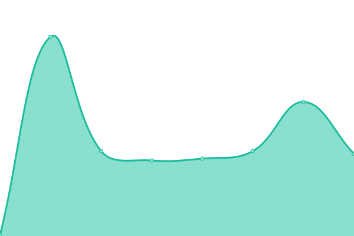

# [📈 Live Status](https://devmuvi.github.io/uptime-monitor): <!--live status--> **🟧 Partial outage**

This repository contains the open-source uptime monitor and status page for [devmuvi](https://devmuvi.github.io/uptime-monitor), powered by [Upptime](https://github.com/upptime/upptime).

With [Upptime](https://upptime.js.org), you can get your own unlimited and free uptime monitor and status page, powered entirely by a GitHub repository. We use [Issues](https://github.com/devmuvi/uptime-monitor/issues) as incident reports, [Actions](https://github.com/devmuvi/uptime-monitor/actions) as uptime monitors, and [Pages](https://devmuvi.github.io/uptime-monitor) for the status page.

<!--start: status pages-->
<!-- This summary is generated by Upptime (https://github.com/upptime/upptime) -->
<!-- Do not edit this manually, your changes will be overwritten -->
<!-- prettier-ignore -->
| URL | Status | History | Response Time | Uptime |
| --- | ------ | ------- | ------------- | ------ |
|  [Checkout (Front)](https://www.pagar.muvinai.com/paso2/total-mensual) | 🟩 Up | [checkout-front.yml](https://github.com/devmuvi/uptime-monitor/commits/HEAD/history/checkout-front.yml) | 

 1607ms
     
 | 

<a href="https://muvinai.github.io/uptime-monitor/history/checkout-front">100.00%</a>
    

|  [Checkout (Back)](https://api.pagar.club/plan/total-mensual) | 🟩 Up | [checkout-back.yml](https://github.com/devmuvi/uptime-monitor/commits/HEAD/history/checkout-back.yml) | 

 739ms
     
 | 

<a href="https://muvinai.github.io/uptime-monitor/history/checkout-back">100.00%</a>
    

|  [MiClub](https://www.app.apisportclub.xyz) | 🟩 Up | [mi-club.yml](https://github.com/devmuvi/uptime-monitor/commits/HEAD/history/mi-club.yml) | 

 280ms
     
 | 

<a href="https://muvinai.github.io/uptime-monitor/history/mi-club">100.00%</a>
    

|  [Procesos](https://procesos.apisportclub.xyz) | 🟩 Up | [procesos.yml](https://github.com/devmuvi/uptime-monitor/commits/HEAD/history/procesos.yml) | 

 281ms
     
 | 

<a href="https://muvinai.github.io/uptime-monitor/history/procesos">100.00%</a>
    

|  [Backend](https://apisportclub.xyz/) | 🟩 Up | [backend.yml](https://github.com/devmuvi/uptime-monitor/commits/HEAD/history/backend.yml) | 

 293ms
     
 | 

<a href="https://muvinai.github.io/uptime-monitor/history/backend">100.00%</a>
    

|  [Backoffice](https://backoffice.apisportclub.xyz/) | 🟩 Up | [backoffice.yml](https://github.com/devmuvi/uptime-monitor/commits/HEAD/history/backoffice.yml) | 

 287ms
     
 | 

<a href="https://muvinai.github.io/uptime-monitor/history/backoffice">100.00%</a>
    

|  Consulta Socio Backoffice | 🟥 Down | [consulta-socio-backoffice.yml](https://github.com/devmuvi/uptime-monitor/commits/HEAD/history/consulta-socio-backoffice.yml) | 

 61ms
     
 | 

<a href="https://muvinai.github.io/uptime-monitor/history/consulta-socio-backoffice">100.00%</a>
    

|  Consulta Socio Backoffice (sin access token) | 🟩 Up | [consulta-socio-backoffice-sin-access-token.yml](https://github.com/devmuvi/uptime-monitor/commits/HEAD/history/consulta-socio-backoffice-sin-access-token.yml) | 

 60ms
     
 | 

<a href="https://muvinai.github.io/uptime-monitor/history/consulta-socio-backoffice-sin-access-token">100.00%</a>
    

|  Consulta Sedes Backoffice | 🟥 Down | [consulta-sedes-backoffice.yml](https://github.com/devmuvi/uptime-monitor/commits/HEAD/history/consulta-sedes-backoffice.yml) | 

 60ms
     
 | 

<a href="https://muvinai.github.io/uptime-monitor/history/consulta-sedes-backoffice">100.00%</a>
    

|  [Backoffice Buen Club](https://back.buen.club/) | 🟩 Up | [backoffice-buen-club.yml](https://github.com/devmuvi/uptime-monitor/commits/HEAD/history/backoffice-buen-club.yml) | 

 322ms
     
 | 

<a href="https://muvinai.github.io/uptime-monitor/history/backoffice-buen-club">100.00%</a>
    

|  [Consulta Socio Backoffice Buen Club](https://back.buen.club/socios) | 🟩 Up | [consulta-socio-backoffice-buen-club.yml](https://github.com/devmuvi/uptime-monitor/commits/HEAD/history/consulta-socio-backoffice-buen-club.yml) | 

 1363ms
     
 | 

<a href="https://muvinai.github.io/uptime-monitor/history/consulta-socio-backoffice-buen-club">100.00%</a>
    

<!--end: status pages-->

[**Visit our status website →**](https://devmuvi.github.io/uptime-monitor)

## 📄 License

- Powered by: [Upptime](https://github.com/upptime/upptime)
- Code: [MIT](./LICENSE) © [devmuvi](https://devmuvi.github.io/uptime-monitor)
- Data in the `./history` directory: [Open Database License](https://opendatacommons.org/licenses/odbl/1-0/)
